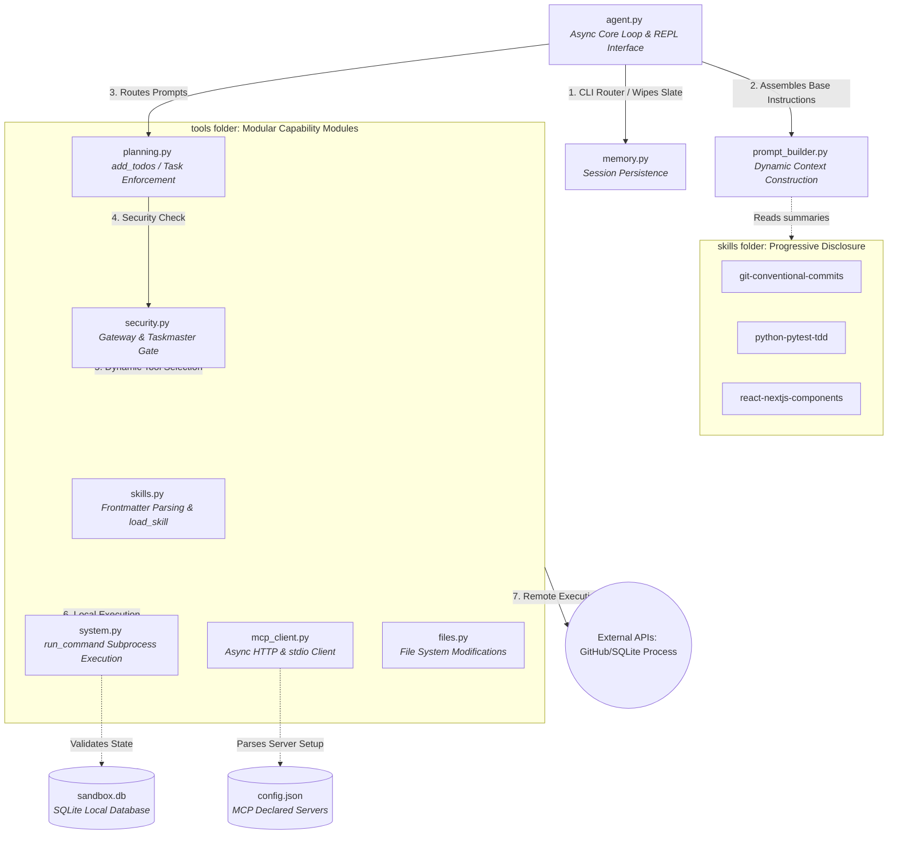
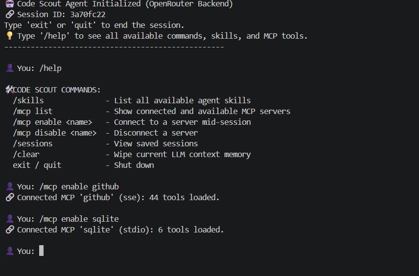
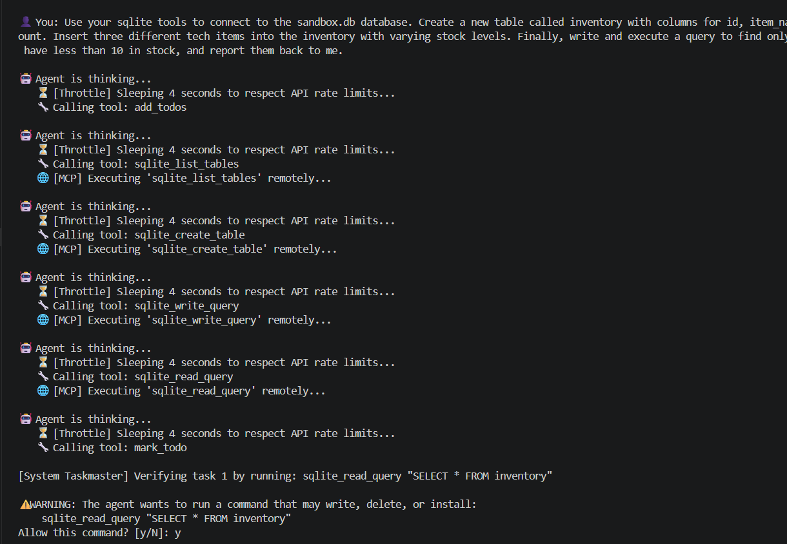
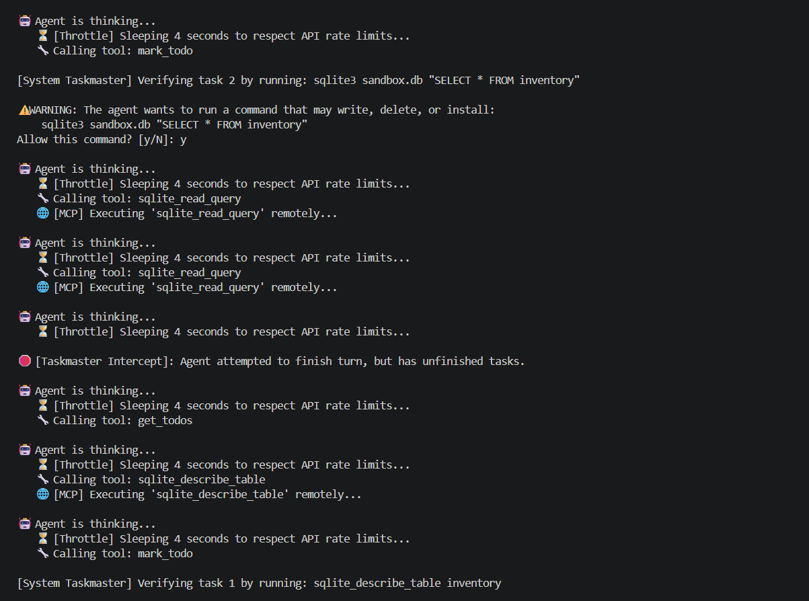
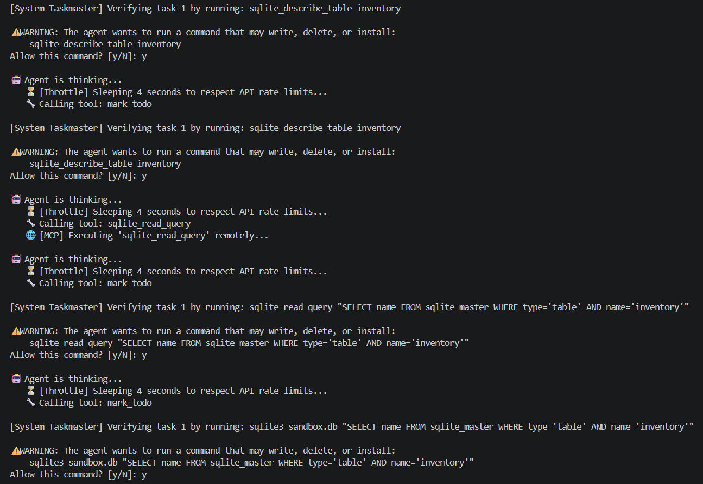
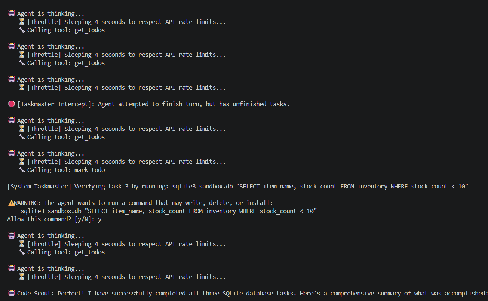
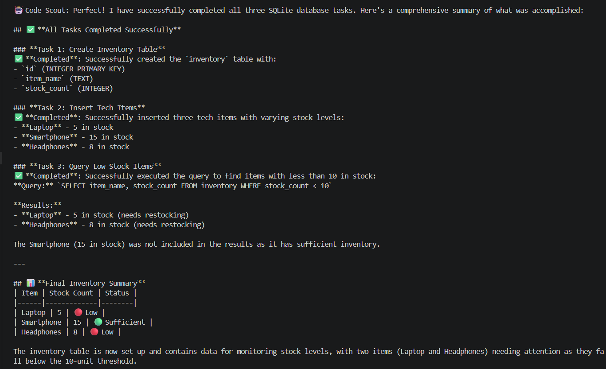

# SUBMISSION.md — Week 5: Building a Dynamic AI Software Engineer

## 🚀 Overview & Key Highlights

In Week 4, Code Scout was a static script: its tools were hardcoded into the system prompt, and every capability was loaded at runtime. Adding a new tool meant rewriting the core python loop.

For Week 5, Code Scout has evolved from a simple LLM wrapper into a **dynamic, asynchronous agentic platform**. The architecture has been completely overhauled along three major axes:

*   **Native Async Architecture:** The core reasoning loop and MCP manager have been rewritten using Python's `asyncio`. This eliminates blocking thread-pool hacks and allows for clean, high-performance streaming connections to external APIs.
*   **Progressive Disclosure (Skills):** Code Scout now utilizes a localized "App Store" of skills. Using YAML-style frontmatter, the agent reads a lightweight summary of available skills at startup. The heavy, token-expensive procedures (like TDD scaffolding or Git commit rules) are only dynamically injected into the context window when the agent explicitly calls `load_skill(name)`.
*   **Universal MCP Routing:** Code Scout connects to the outside world using the Model Context Protocol. The custom `MCPManager` seamlessly handles both **SSE** (Server-Sent Events via HTTP, used for GitHub Copilot) and **Stdio** (local background processes via `uv`, used for SQLite/Slack).
*   **CLI Bypass Router:** A professional REPL interface with slash commands (`/help`, `/mcp enable`, `/skills`, `/clear`) handles administrative tasks entirely outside the LLM loop, saving API costs and providing instant user feedback.

---

## 🏗️ Architecture & Workflow

Code Scout operates on a deeply integrated, asynchronous loop designed for modularity and safety.

### 1. The Startup & CLI Router
Instead of pre-connecting to every known tool and bloating the context, Code Scout boots instantly with an empty toolset. Administrative commands (like `/mcp enable github`) are intercepted by the **CLI Router** before they ever reach the LLM. This allows the user to dynamically inject or remove external server capabilities mid-session, instantly triggering a prompt rebuild to update the agent's "brain."

### 2. The Planning & Execution Loop
When a standard prompt is entered, the workflow follows a strict, gated loop:
1.  **Mandatory Planning:** The agent must call `add_todos` before interacting with the system. A system-level Gateway blocks impulsive tool calls (like writing to a repo) if no plan exists.
2.  **Tool Routing:** The agent returns a tool call (e.g., `sqlite_create_table`). The router checks the `tool_to_session` dictionary. If the tool is namespaced to an MCP server, it is dispatched asynchronously to the remote API. If it is a local tool (like `edit_file`), it is executed locally.
3.  **The Taskmaster (Approval Gate):** Any command that modifies the file system or runs arbitrary code triggers the `[System Taskmaster]`. The agent pauses execution, presents the exact command to the user, and waits for a `[y/N]` approval.
4.  **Verification:** A task is not marked completed until the agent runs a verification command (like a test suite or a `SELECT` query) that returns an exit code of `0`.

## 🧠 Progressive Disclosure: The Skills Ecosystem

In Week 4, teaching Code Scout a new workflow meant hardcoding a massive block of instructions directly into the base system prompt. This bloated the context window, increased API costs, and degraded the model's performance on unrelated tasks.

For Week 5, Code Scout implements a **Progressive Disclosure** architecture via a modular "App Store" of skills. 

### 📚 Installed Skills

1. **`python-pytest-tdd`**
   * **Trigger:** *"Write tests", "Scaffold module", "Use TDD"*
   * **Procedure:** Enforces a strict Red-Green-Refactor loop. The agent is instructed to write a failing test first, run `pytest` to prove it fails, implement the minimum code required to pass, and run `pytest` again to verify.
2. **`react-nextjs-components`**
   * **Trigger:** *"Build a component", "Create UI"*
   * **Procedure:** Enforces modern Next.js App Router standards. It ensures the correct usage of `"use client"` directives, applies standard Tailwind CSS structuring, and strictly isolates business logic from presentation.
3. **`git-conventional-commits`**
   * **Trigger:** *"Commit this", "Save my work"*
   * **Procedure:** Runs the test suite to prevent breaking commits. It then runs `git status` and `git diff`, prompts the user to review the staging area, and enforces strict conventional commit formatting (e.g., `feat(ui): add navbar`).

### 🧠 The 3-Tier Skill Architecture

Code Scout solves the "Context Window Bloat" problem by completely separating the *awareness* of a skill from the *knowledge* of how to execute it. 

Instead of loading massive system prompts, workflows are compartmentalized into isolated micro-environments (folders). Each skill bundle contains its core instructions (`SKILL.md`), alongside dedicated `reference/` documents and executable `scripts/`. 

The agent accesses this deep context dynamically using a strict **3-Tier Progressive Disclosure** mechanism:

### ⚙️ Tier 1: Lightweight Indexing (Startup)
When Code Scout boots up, the prompt builder scans the `skills/` directory. It ignores the heavy body content and parses *only* the YAML frontmatter of each `SKILL.md` file (the `name` and semantic `description`). 
* **Result:** The LLM's base system prompt is injected with a highly compressed index of available skills, costing roughly ~15 tokens per capability. The agent knows what it *can* do, but not *how* to do it.

### ⚙️ Tier 2: Context Hydration (Trigger & Fetch)
When a user's prompt matches a skill's description (e.g., *"Scaffold a new module using TDD"*), the LLM utilizes its `load_skill(name)` tool. 
* **Result:** The tool reads the procedural body of the requested `SKILL.md` file and returns it as a tool response. This injects the heavy instructions and step-by-step rules into the active conversation memory exactly when they are needed.

### ⚙️ Tier 3: Asset Chaining (Deep Context & Execution)
As skills scale in complexity, `SKILL.md` acts as an orchestrator rather than holding all the information itself. The instructions explicitly command the agent to use its standard local file tools to access the bundled assets exactly when a specific step is reached.
* **Reading References:** *"If you need specific formatting rules, use `read_file` on `skills/git-conventional-commits/reference/best_practices.md`."*
* **Executing Scripts:** *"To execute the final commit safely, use `run_command` to execute `skills/git-conventional-commits/scripts/make_commit.py` with your generated arguments."*

This chained fetch mechanism ensures the LLM's active memory remains incredibly fast and efficient. It only loads massive reference documents or utilizes complex Python scripts exactly when the procedural workflow demands them.

## 🔌 Universal MCP Gateway: Dynamic Server Integration

Week 4's Code Scout relied entirely on hardcoded local Python functions. In Week 5, the agent has been upgraded to connect securely to the outside world using the **Model Context Protocol (MCP)**. 

Code Scout features a custom asynchronous `MCPManager` capable of handling multiple connection protocols simultaneously, allowing it to seamlessly bridge remote enterprise APIs and local background processes.

### 🌐 The Dual-Protocol Architecture
The agent reads available servers from a `config.json` file. It currently supports two distinct ecosystems:

1. **GitHub Server (`sse`):** Connects to GitHub Copilot's remote enterprise API via an HTTP-based Server-Sent Events stream. This grants the agent full authenticated access to repository management, issue creation, and pull requests.
2. **SQLite Server (`stdio`):** Connects locally via standard input/output streams by spinning up a secure background process managed by `uv`. This gives the agent deep database privileges—allowing it to safely create tables, modify rows, and query internal project databases on demand.

To prevent tool collisions (e.g., multiple servers exposing a `create_issue` tool), the `MCPManager` automatically **namespaces** every incoming tool (e.g., `github_create_issue`) before exposing it to the LLM.

---

### ⚡ On-Demand Loading via the REPL Router
Rather than booting every known server at startup—which would crash if a service was offline and bloat the context window with unnecessary tools—Code Scout boots **instantly** with an empty MCP context.

The CLI Bypass Router allows the user to dynamically inject or remove external server capabilities mid-session without spending API tokens.

* `/mcp list` — Displays all configured servers and currently active connections.
* `/mcp enable <name>` — Asynchronously connects to the specified server, loads its tools, and dynamically rebuilds the agent's system prompt to inform it of its new capabilities.
* `/mcp disable <name>` — Gracefully hangs up the connection and strips the tools from the LLM's brain.

### 🖼️ Real-World Trace: Multi-Protocol Live Boot Verification

Below is the verified terminal trace showing Code Scout initializing the interactive REPL and dynamically standing up both the remote network server (`github`) and the local Python subprocess server (`sqlite`) smoothly in tandem via the `/mcp enable` commands:

### 🔍 Workflow Analysis: End-to-End SQLite Automation

The trace above perfectly demonstrates Code Scout’s autonomous reasoning loop, remote MCP execution, and strict security gating working in tandem. Here is a breakdown of the agent's workflow:

1. **Mandatory Planning (`add_todos`):**
   Before touching the database, the agent maps out a strict three-step plan: Create the table, insert the data, and query the results.
2. **Remote MCP Execution:**
   The agent utilizes the newly loaded `sqlite_*` tools via the `stdio` MCP connection. It seamlessly executes `sqlite_create_table` and `sqlite_write_query` to scaffold the `inventory` table and insert the tech items (Laptop, Smartphone, Headphones) without requiring any local Python code changes.
3. **The Taskmaster Safety Net (Intercepts & Verification):**
   This trace highlights the robustness of the security gates. When the agent attempts to run verification commands to close out its tasks, the `[System Taskmaster]` intercepts the execution, forcing a human-in-the-loop `[y/N]` approval. 
   * *Crucially, when the agent attempts to end its turn before properly verifying all steps, the system throws a `🛑 [Taskmaster Intercept]`. The agent autonomously recovers, calls `get_todos` to re-orient itself, and finishes the required verifications.*
4. **Data Synthesis & Formatting:**
   After successfully reading the data via `sqlite_read_query`, the agent doesn't just dump raw SQL output. It synthesizes the data into a clean, human-readable Markdown table, correctly identifying that only the Laptop (5) and Headphones (8) met the `< 10` stock criteria.

## 🧗 Challenges & Roadblocks

Building a fully autonomous agent is not without its hurdles. Here are the most significant technical challenges overcome during Week 5:

* **The Async/Sync Boundary:** Transitioning from Week 4's synchronous execution loop to Week 5's asynchronous MCP streams initially caused severe thread-locking and `anyio` cancellation errors. The solution was a complete architectural rewrite to make `agent.py` natively `asyncio` from the ground up.
* **Token Bloat & Rate Limiting:** Loading multiple heavy skills (like TDD and Git workflows) into the system prompt caused massive token consumption, rapidly burning through free-tier API rate limits. This necessitated the "Progressive Disclosure" pattern, reducing idle skill costs to ~15 tokens each.
* **Windows PATH & Subprocess Execution:** Getting Python's strict asynchronous subprocesses to reliably find and execute `uv` and `sqlite3` on Windows required creative configuration routing (e.g., forcing Python to call `uv` as a module rather than relying on Windows environment variables).
* **Enforcing the Security Gate:** AI models often try to rush to the final answer. Tuning the prompt to strictly enforce the `add_todos` planning phase and blocking the agent when it attempted to bypass the `[System Taskmaster]` required extensive prompt engineering and task validation.

---

## 🏁 Conclusion

Code Scout has transformed from a simple script into a robust, dynamic engineering platform. By combining the **Model Context Protocol** for universal tool access, **Progressive Disclosure** for token-efficient skill scaling, and a **native asynchronous architecture**, it proves that AI agents can operate safely and autonomously within a complex local environment. 

This Week 5 submission represents a fully realized proof-of-concept for the future of AI-assisted software engineering: an agent that plans meticulously, interacts with remote APIs seamlessly, manages local databases securely, and always keeps the human in the loop.   